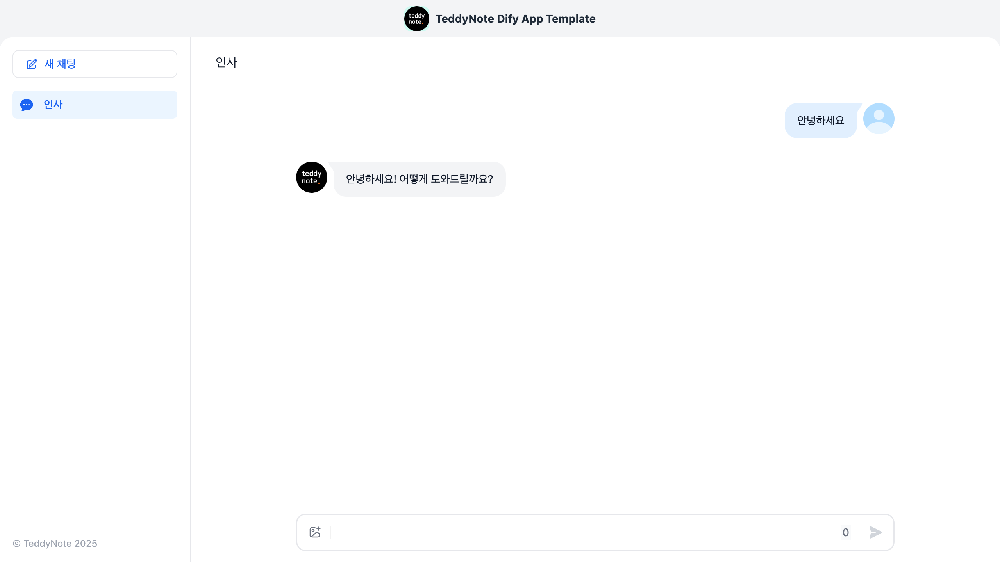
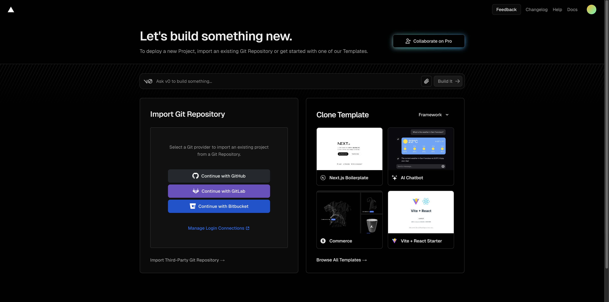
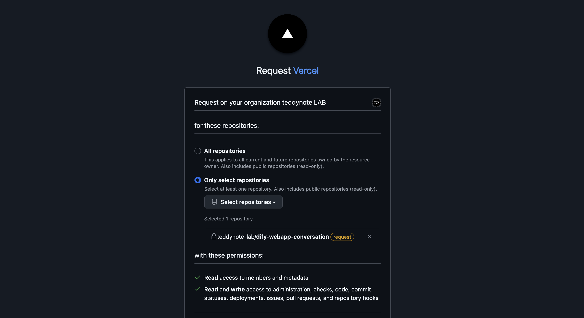
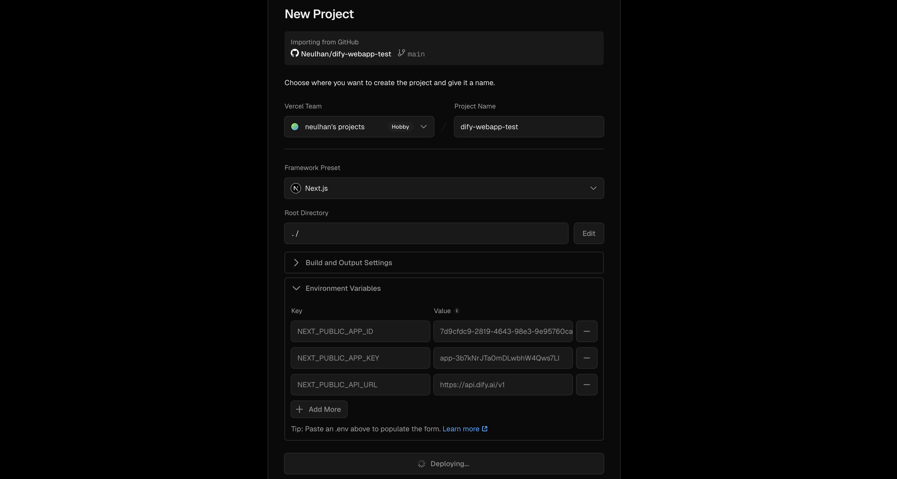
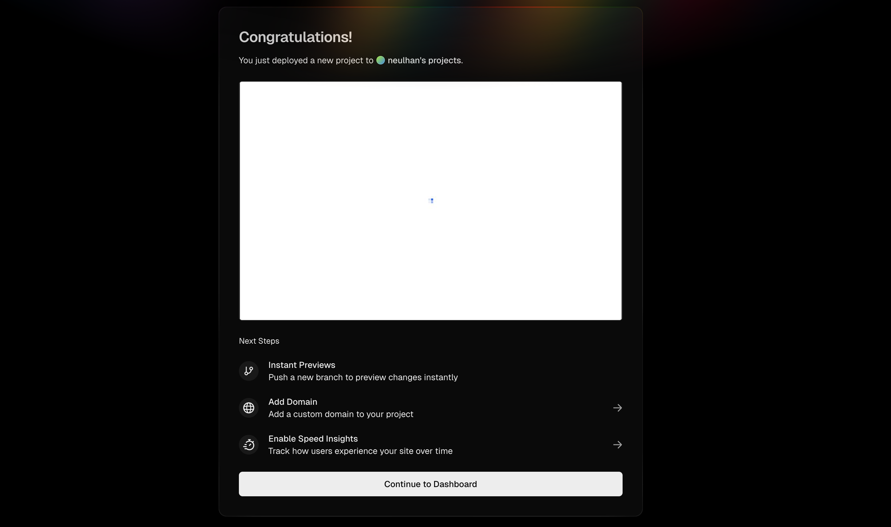
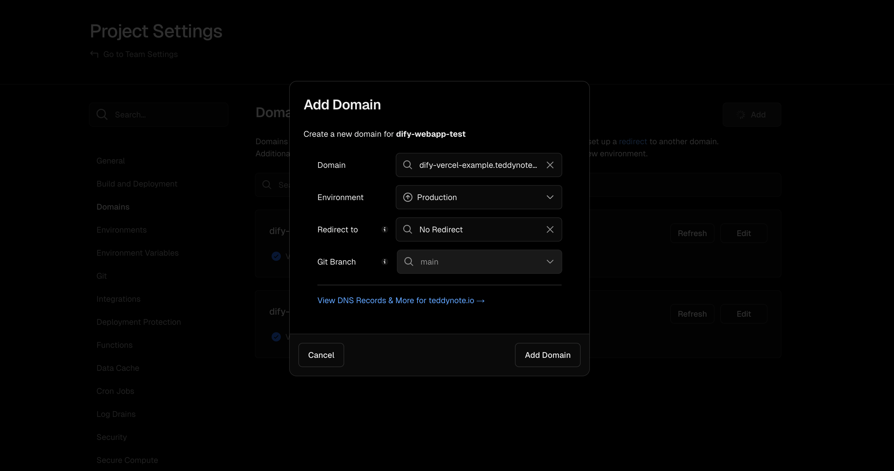
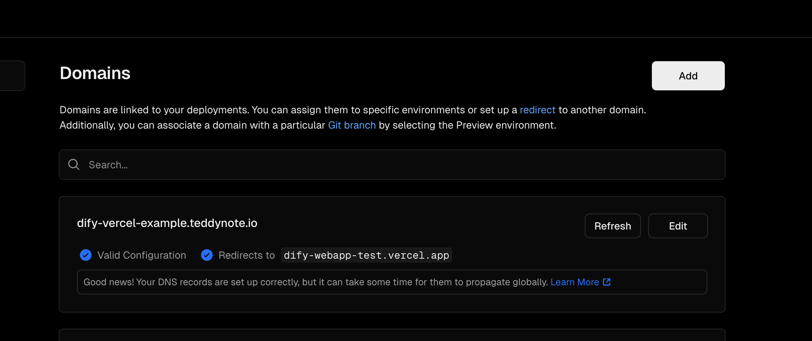
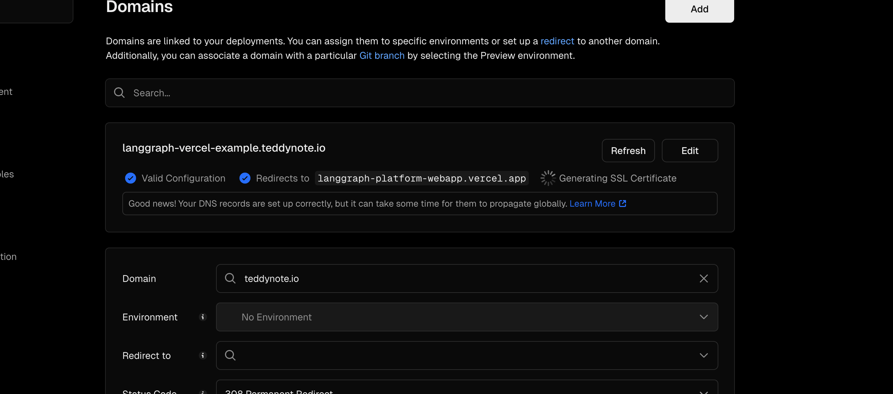

# 💎 Dify 채팅형 웹 앱 템플릿

> [!NOTE]
> 현재 레포지토리는 Dify 의 공식 템플릿인 [webapp-conversation](https://github.com/langgenius/webapp-conversation) 의 포크 버전입니다.



기존 레포지토리에서 추가된 내용들

- 한국어 지원 추가
- 로고 이미지 커스텀
- powered by Dify 제거
- 기본 privacy 페이지 제공

## 앱 설정

현재 디렉토리에 `.env.local` 파일을 생성하고 `.env.example`의 내용을 복사하여 다음 내용을 설정하세요:

```
# APP ID: 앱의 고유 식별자입니다. 앱 상세 페이지 URL에서 찾을 수 있습니다.
# 예를 들어, URL `https://cloud.dify.ai/app/xxx/workflow`에서 `xxx` 값이 APP ID입니다.
NEXT_PUBLIC_APP_ID=

# APP API Key: 앱의 API 요청을 인증하는 데 사용되는 키입니다.
# 앱의 "API Access" 페이지에서 우측 상단의 "API Key" 버튼을 클릭하여 생성할 수 있습니다.
NEXT_PUBLIC_APP_KEY=

# APP URL: API의 기본 URL입니다. Dify 클라우드 서비스를 사용하는 경우, 다음으로 설정하세요: https://api.dify.ai/v1
NEXT_PUBLIC_API_URL=
```

`config/index.ts` 파일에서 추가 설정을 할 수 있습니다:

```js
export const APP_INFO: AppInfo = {
  title: "TeddyNote Dify App Template",
  description: "TeddyNote Dify App Template",
  copyright: "TeddyNote",
  privacy_policy: "/privacy",
  default_language: "ko",
  logoUrl: "/teddynote-logo.png",
};
```

로고 이미지를 직접 호스팅하려면 `src/public` 폴더 아래에 이미지 파일을 넣어주세요.  
이후 `logoUrl: "/your-image-file-name.png"` 와 같이 설정해주시면 됩니다.

### 개인정보 처리방침 편집

`src/app/privacy/page.tsx` 파일을 편집해주세요.  
이후 http://localhost:3000/privacy 에서 확인하실 수 있습니다.

## 시작하기

먼저 의존성을 설치해주세요:

```bash
npm install
# 또는
yarn
# 또는
pnpm install
```

그 다음, 개발 서버를 실행할 수 있습니다:

```bash
npm run dev
# 또는
yarn dev
# 또는
pnpm dev
```

브라우저에서 [http://localhost:3000](http://localhost:3000)을 열어 결과를 확인하세요.

## Docker 사용하기

```
docker build . -t <DOCKER_HUB_REPO>/webapp-conversation:latest
# 이제 3000번 포트에서 접근할 수 있습니다
docker run -p 3000:3000 <DOCKER_HUB_REPO>/webapp-conversation:latest
```

브라우저에서 [http://localhost:3000](http://localhost:3000)을 열어 결과를 확인하세요.

## 🚜 프로덕션 배포

Next.js 앱을 배포하는 가장 쉬운 방법은 Next.js의 제작자인 [Vercel Platform](https://vercel.com/new?utm_medium=default-template&filter=next.js&utm_source=create-next-app&utm_campaign=create-next-app-readme)을 사용하는 것입니다.

자세한 내용은 [Next.js 배포 문서](https://nextjs.org/docs/deployment)를 확인하세요.

### Vercel 로 3분 안에 배포하기

> [!WARNING] > [Vercel Hobby](https://vercel.com/pricing)를 사용하는 경우, Vercel의 제한으로 인해 메시지가 잘릴 수 있습니다.

1. 이 Repository 를 클론 or Use this Template 을 통해, 본인의 Repository 로 생성
   
2. 해당 Repo 를 [Vercel 페이지](https://vercel.com/new) 에서 권한 부여해서 가져오기
   
3. 해당 Repo 를 Import 버튼 누르고 환경변수 입력 후 > Deploy 버튼 클릭
   
4. 배포 완료
   

#### (추가) 커스텀 도메인 연결

1. 위의 배포 완료 화면에서 Add Domain 버튼을 누르거나 Project Settings > Domains > Add 를 통해 해당 화면 진입
   
   Domain 입력칸에 원하는 도메인 입력 (ex. www.teddynote.com) 후 Add Domain 버튼 클릭
2. 아직 도메인 라우팅 테이블 설정이 안되었기 때문에 Invalid Configuration 에러 발생
   
3. DNS 테이블에 CNAME 추가 (가비아, namecheap 등 DNS 호스팅 사이트에는 모두 이 기능이 있습니다)
   
4. 추가 후 기다리면 자동으로 커스텀 도메인 연결 + https 설정
   

## License

MIT License
